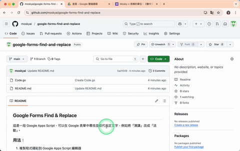

## Google Forms Find & Replace

這是一段 Google Apps Script，可以在 Google 表單中尋找並取代指定文字，例如將「演講」改成「活動」。

### 用法：
1. 複製程式碼貼到 Google Apps Script 編輯器
2. 修改 `formUrl` 為你的表單連結
3. 執行 `findAndReplaceInSpecifiedForm()` 函數
